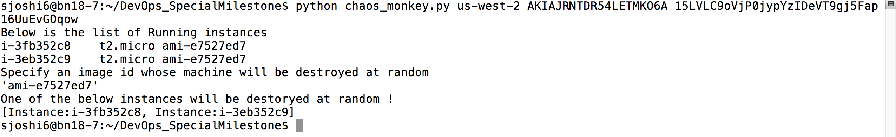

# DevOps_SpecialMilestone

For CSC 791, as the Special milestone holds more weightage, we have implemeted
the Special Milestone as a combination of two seperate milestone tasks.

##Task 1: Setup a Ganglia Monitoring System across the deployed servers.

Ganglia is used for monitoring the CPU, I/O Statistics, and Network performance of servers in a distributed environment.
A ganglia Monitoring system has two components 
- 1. A master called Gmetad
- 2. Multiple slaves --> each of which is a deployment server (in our case 2 Nodes)

####The master setup steps are as follows:

Before the setup begins we need a user with root permission to edit the conf files.

######Setup:

- 1. Installing the Ganglia master and PHP frontend 
```
sudo apt-get install -y ganglia-monitor rrdtool gmetad ganglia-webfrontend
```
- 2. Copying the necessary files 
```
sudo cp /etc/ganglia-webfrontend/apache.conf /etc/apache2/sites-enabled/ganglia.conf
```
- 3. sudo vi /etc/ganglia/gmetad.conf    --> Edit the code snippet shown below
```
data_source "devops_server_cluster" localhost
```

- 4. sudo vi /etc/ganglia/gmond.conf     --> Make the changes shown below
```
[...]
cluster {
  name = "devops_server_cluster" 
  owner = "unspecified"
  latlong = "unspecified"
  url = "unspecified"
}
[...]
//////////////////////////////////////////////////////
[...]
udp_send_channel   {
  #mcast_join = 239.2.11.71 ## commented out this line
  host = localhost
  port = 8649
  ttl = 1
}
[...]
/////////////////////////////////////////////////////
[...]
udp_recv_channel {
  #mcast_join = 239.2.11.71 ## commented out this line
  port = 8649
  #bind = 239.2.11.71 ## commented out this line
}
```
- 5. Restart Ganglia-monitor, Gmetad and Apache.
```
sudo service ganglia-monitor restart && sudo service gmetad restart && sudo service apache2 restart
```
####The slave setup steps are as follows:

The below steps have to be manually performed on all slave nodes.

######Setup:

- 1. Installing the Ganglia Gmond process on Slaves
```
sudo apt-get install -y ganglia-monitor
```
- 2. Similar to the master edit the slave config file
```
sudo vi /etc/ganglia/gmond.conf

//////////////////////////////////

[...]
cluster {
  name = "devops_server_cluster"
  owner = "unspecified"
  latlong = "unspecified"
  url = "unspecified"
[...]

///////////////////////////////////

[...]
udp_send_channel {
  #mcast_join = 239.2.11.71   ## Commented this line
  host = x.x.x.x   ## IP address of master node
  port = 8649
  ttl = 1
}
[...]

///////////////////////////////////
Comment the udp_recv_channels block
```

- 3. Restarting the monitors on all slaves
```
sudo service ganglia-monitor restart
```

####Screenshot of the Ganglia Monitoring Tool Summary.

The below screenshot shows four graphs
- 1. Total load on all the servers (Top Left)
- 2. Memory Utilization (Top Right)
- 2. CPU Utilization (Bottom Left)
- 3. Network Utilization (Bottom Right)


####Screenshot of Detailed graphs about the localhost


####Screenshot of Stacked Info


##Task 2: Implementing dummy monkeys from the Simian Army.

#### Monkey 1: The Chaos Monkey

The code can be found in the file named: **chaos_monkey.py**

Our implementation of the Choas Monkey uses Python - Boto module.

- The program accepts as input a **target location**, **developer access key** , **secret key**
- The utility connects to AWS and determines all active/running instances and produces a list.
- It prompts the user to insert a target OS whose instances will be destroyed at random.
- The utility selects a random instance from the chosen OS and terminates the machine.

######Usage:
```
python chaos_monkey.py us-west-2 AKIAJRNTDR54LET6A 15LVLCDeVT9gj5Fap16Uu
```

######Before running Chaos Monkey


######Program in action


######Screenshot of AWS displaying shutdown of instances due to chaos monkey:


#### Monkey 2: The Burning Monkey

The job of this monkey is to launch a small process on the server node that burns out the CPU cycles of the server and de prioritzes the original server task.

The script used for burning CPU cycles on server is as follows:
```
#!/bin/bash

count=1

while [ true ]
do
  echo "Counter $count "
  count=$(( $count + 1 ))
done
```
The Monkey can be found in the script named **burn_monkey.sh**
We deploy this monkey from a remote location into our EC2 Server infrastructure by using SCP and SSH.
This monkey only acts on the targeted node.

It accepts as a parameter the ssh .pem key of the targeted EC2 instance and its IP Address.

```
Usage:

./burn_monkey.sh sjoshi6.pem 52.11.146.198
```
The below screenshots display the effect of burn_monkey on CPU utilization. The output is of the 'top' Unix command.

Screenshot:
-  1.Burn Monkey not Deployed:


-  2.Burn Monkey in action


